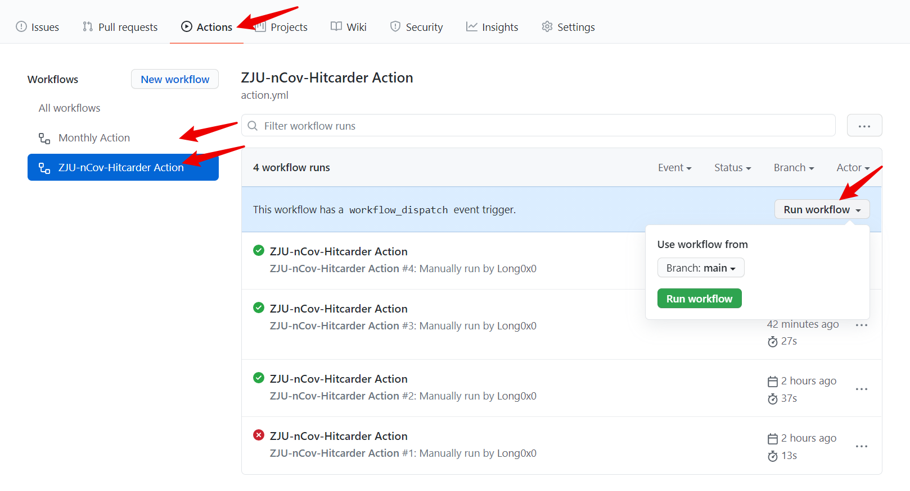
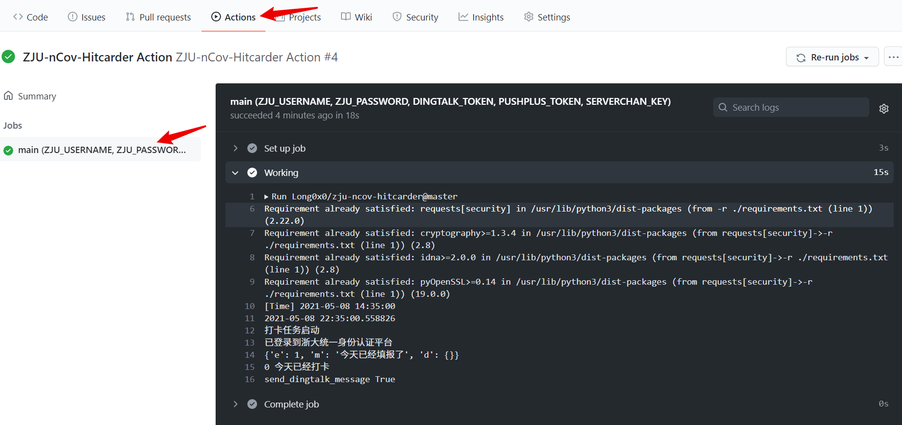

# ZJU-nCov-Hitcarder-Sample

Sample for https://github.com/Long0x0/ZJU-nCov-Hitcarder.

浙大nCov肺炎健康打卡定时自动脚本

forked from [Tishacy/ZJU-nCov-Hitcarder](https://github.com/Tishacy/ZJU-nCov-Hitcarder)

 - 使用 Github Action 实现定时打卡，无需本地运行或服务器
 - 可配置完成打卡的微信/钉钉消息提醒
 - 默认每次提交上次所提交的内容（只有时间部分更新）
 - 增加了系统表单更新提醒
 - 打卡信息有变时，请手动打卡一次

update: 2021.05.08

## Usage

1. fork，或自己新建repo并创建 `.github\workflows\action.yml` 和 `monthly.yml`。
   
2. 配置定时运行时间
   
   在 .github\workflows\action.yml 中更改时间：
   ```yml
   on:
   workflow_dispatch:
   schedule:
      - cron: '0 23 * * *'
   ```
   `0 23 * * *`表示UTC 23:00，即北京时间7:00打卡（经测试，实际运行时间比设定时间晚几分钟到几十分钟）。
   
3. 配置帐号
   
   Settings > Secrets > New repository secrets， 添加 `ZJU_USERNAME`，内容为浙大通行证账号（学号），添加`ZJU_PASSWORD`，内容为浙大通行证密码。

   

4. 配置提醒方式（任选一种）
   
   <details>
     <summary>钉钉群机器人（推荐）</summary>

     - PC端钉钉 > 新手体验群 > 群设置 > 智能群助手 > 添加机器人 > 自定义，名字随便填，安全设置选择`自定义关键字`，填`打卡`，然后下一步复制Webhook。

     - Settings > Secrets > New repository secrets， 添加`DINGTALK_TOKEN`，内容为刚才复制的Webhook中 `access_token=` 后面的内容。

   </details>
   
   <details>
     <summary>微信ServerChan（不再推荐）</summary>
 
     - 前往 http://sc.ftqq.com/3.version ，按首页的提示用GitHub账号登录，绑定微信，即可获得SCKEY。

     - Settings > Secrets > New repository secrets， 添加`SERVERCHAN_KEY`，内容为刚才复制的SCKEY。

   </details>
   
   <details>
     <summary>微信pushplus（不再推荐）</summary>

     - 前往 https://pushplus.hxtrip.com ，微信扫码，点击激活消息，复制token。

     - Settings > Secrets > New repository secrets， 添加`PUSHPLUS_TOKEN`，内容为刚才复制的token。

   </details>

5. 配置多人打卡（可选）

   在 .github\workflows\action.yml 中添加一组，自行添加对应的Secrets。

   ```yml
      - username: ZJU_USERNAME
        password: ZJU_PASSWORD
        dingtalk_token: DINGTALK_TOKEN
        pushplus_token: PUSHPLUS_TOKEN
        serverchan_key: SERVERCHAN_KEY
      - username: ZJU_USERNAME2
        password: ZJU_PASSWORD2
        dingtalk_token: DINGTALK_TOKEN2
        pushplus_token: PUSHPLUS_TOKEN2
        serverchan_key: SERVERCHAN_KEY2
   ```

6. 测试
   
   Actions > ZJU-nCov-Hitcarder Action > Enable workflow > Run workflow。

   Actions > Monthly Action > Enable workflow > Run workflow。

   


   查看log：

   

7. 停用

   Actions > ZJU-nCov-Hitcarder Action > Disable workflow。


## Thanks

感谢原项目作者和贡献者

## 参考链接
GitHub Actions https://docs.github.com/en/free-pro-team@latest/actions

钉钉群机器人 https://ding-doc.dingtalk.com/doc#/serverapi3/iydd5h

ServerChan http://sc.ftqq.com/3.version

pushplus https://pushplus.hxtrip.com


## LICENSE

Copyright (c) 2020 tishacy.

Licensed under the [MIT License](https://github.com/Tishacy/ZJU-nCov-Hitcarder/blob/master/LICENSE)

